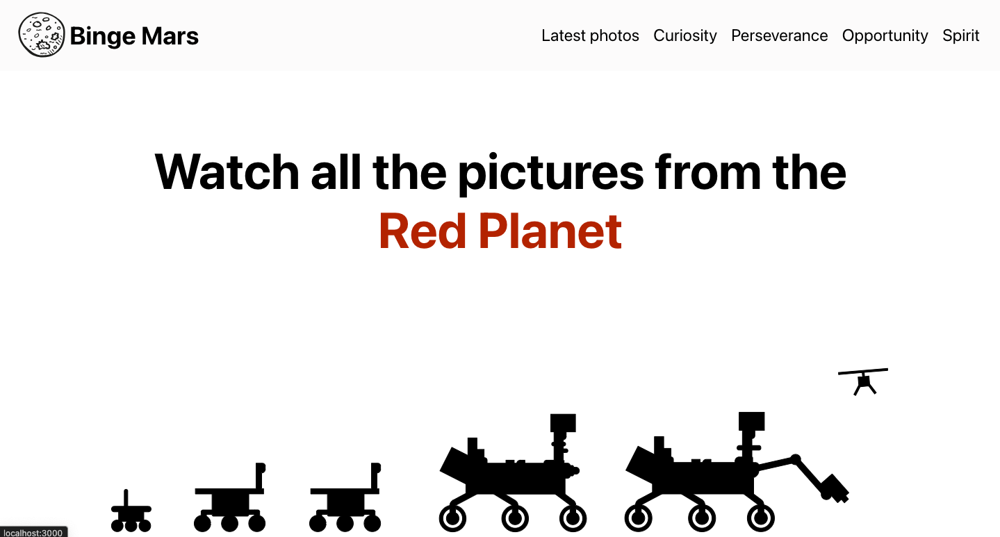

# [Bingemars](http://bingemars.netlify.app/)
Explore the Red Planet through the lens of NASA's rovers! Binge Mars is a React app that fetches stunning photos from Mars using NASA's API. Currently, you can view the latest photos from the Curiosity and Perseverance rovers. More features are coming soon, including photos from different sols! Check it out at https://bingemars.netlify.app/

## 🚀 Features

- 📸 View the latest photos from Curiosity and Perseverance
- 🌑 Upcoming: Browse photos from various sols (Martian days)
- 🔗 Easy navigation with React Router

## 🛠️ Installation

1. Clone the repository:
    ```bash
    git clone https://github.com/yawok/bingemars.git
    cd bingemars
    ```

2. Install dependencies:
    ```bash
    npm install
    ```

3. Start the development server:
    ```bash
    npm start
    ```


## 🖼️ Gallery

Here's a sneak peek of what you'll find:

### Screenshots



### Latest Photos from Curiosity


### Latest Photos from Perseverance


## 🌌 Roadmap

- [ ] Add photo browsing by sol
- [ ] Improve mobile responsiveness
- [ ] Add more rovers and photo filters

## 🧑‍🚀 Contributing

Contributions are welcome! Please open an issue or submit a pull request.


Happy exploring!

